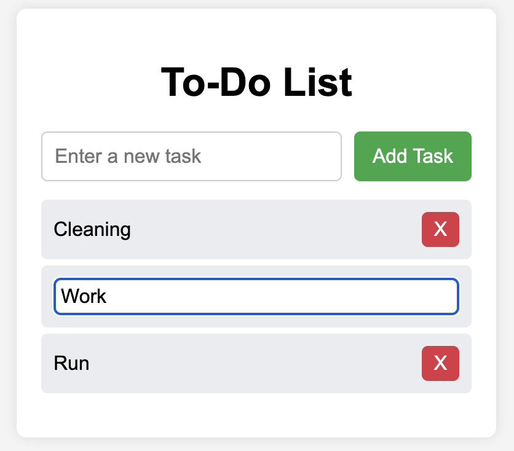

# 📝 To-Do List

A simple and efficient **To-Do List** application that allows users to **add, edit, delete, and save tasks using LocalStorage**. Built with **HTML, CSS, and JavaScript**.

## 🚀 Features
- ✅ Add new tasks
- 📝 Edit existing tasks by clicking on them
- ❌ Delete tasks with a single click
- 💾 Tasks are saved in **LocalStorage**, so they persist after refreshing the page
- 🎨 Simple and responsive UI

## 🖼️ Screenshot
